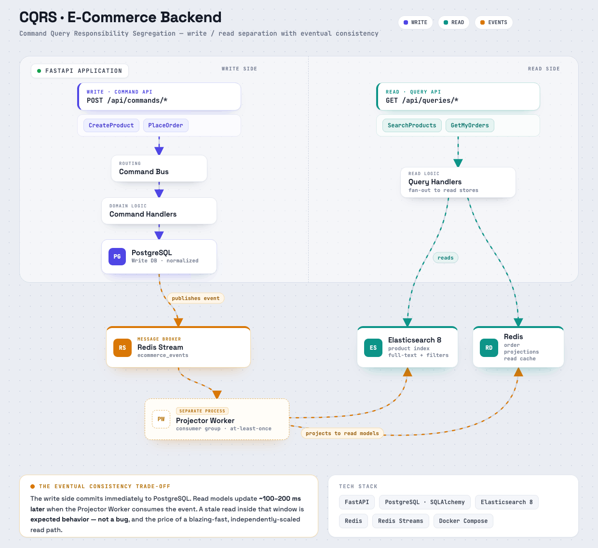

# CQRS E-Commerce Demo 

> A minimal but realistic implementation of **Command Query Responsibility Segregation (CQRS)** using Python, FastAPI, PostgreSQL, Elasticsearch, and Redis.

Part of the **HandsOn System Design** series — practical implementations of real architectural patterns.

---

## Architecture



---

## What Is CQRS?

CQRS separates the **write model** from the **read model**:

| | Write Side | Read Side |
|---|---|---|
| **Optimized for** | Consistency & validation | Speed & flexibility |
| **Database** | PostgreSQL (normalized) | Elasticsearch + Redis (denormalized) |
| **Operations** | Create, Update, Delete | Search, List, Aggregate |
| **API prefix** | `/api/commands/*` | `/api/queries/*` |

The two sides stay in sync via **Redis Streams** and a **Projector Worker** — which introduces **eventual consistency** as the trade-off.

---

## Architecture

```
┌─────────────────────────────────────────────────────────────────┐
│                        FastAPI Application                       │
│                                                                  │
│   /api/commands/*                    /api/queries/*              │
│   (Write Side)                       (Read Side)                 │
│        │                                    │                    │
│        ▼                                    ▼                    │
│   Command Bus                        Query Handlers              │
│        │                             │            │              │
│        ▼                             ▼            ▼              │
│   Command Handlers             Elasticsearch    Redis            │
│        │                       (products)    (orders)            │
│        ▼                                                         │
│   PostgreSQL ──► Event Published                                 │
│   (Write DB)        │                                            │
└─────────────────────┼────────────────────────────────────────────┘
                       │
                       ▼
              Redis Stream (ecommerce_events)
                       │
                       ▼
              ┌─────────────────┐
              │ Projector Worker │  ← Separate process
              └─────────────────┘
               │               │
               ▼               ▼
        Elasticsearch        Redis
        (product index)   (order projections)
```

---

## The Two Commands

| Command | Endpoint | What It Does |
|---|---|---|
| `CreateProduct` | `POST /api/commands/create-product` | Writes to PostgreSQL, emits `product.created` event |
| `PlaceOrder` | `POST /api/commands/place-order` | Validates stock, decrements, emits `order.placed` event |

## The Two Queries

| Query | Endpoint | Where It Reads |
|---|---|---|
| `SearchProducts` | `GET /api/queries/products` | Elasticsearch |
| `GetMyOrders` | `GET /api/queries/orders/{customer_id}` | Redis |

---

## Project Structure

```
data-storage-cqrs/
├── docker-compose.yml          # PostgreSQL + Elasticsearch + Redis
├── requirements.txt
├── .env.example
│
├── src/
│   ├── config.py               # Settings from .env
│   │
│   ├── api/
│   │   ├── main.py             # FastAPI app entry point
│   │   ├── command_router.py   # POST /api/commands/* (write side)
│   │   └── query_router.py     # GET  /api/queries/*  (read side)
│   │
│   ├── commands/               # Write side
│   │   ├── models.py           # Command dataclasses
│   │   ├── handlers.py         # Business logic + DB writes
│   │   └── bus.py              # Routes command → handler
│   │
│   ├── queries/                # Read side
│   │   ├── models.py           # Query dataclasses
│   │   └── handlers.py         # Reads from ES + Redis
│   │
│   ├── events/
│   │   └── publisher.py        # Publishes events to Redis Stream
│   │
│   ├── projector/
│   │   └── worker.py           # Consumes stream → updates read models
│   │
│   └── db/
│       ├── postgres.py         # SQLAlchemy engine + session
│       └── models.py           # ORM: Product, Order, OrderItem
│
└── scripts/
    └── seed.py                 # Seeds sample products via command API
```

---

## Local Setup

### Prerequisites
- Docker & Docker Compose
- Python 3.11+

### 1. Clone and install

```bash
git clone https://github.com/yourusername/data-storage-cqrs.git
cd data-storage-cqrs

python -m venv venv
source venv/bin/activate      # Windows: venv\Scripts\activate
pip install -r requirements.txt
```

### 2. Copy environment file

```bash
cp .env.example .env
```

### 3. Start infrastructure

```bash
docker-compose up -d
```

Wait ~30 seconds for Elasticsearch to be ready.

### 4. Start the API (Terminal 1)

```bash
uvicorn src.api.main:app --reload
```

### 5. Start the Projector Worker (Terminal 2)

```bash
python -m src.projector.worker
```

### 6. Seed sample data (Terminal 3)

```bash
python -m scripts.seed
```

---

## Try It Out

### Interactive API Docs
Open [http://localhost:8000/docs](http://localhost:8000/docs) in your browser.

### Create a product
```bash
curl -X POST http://localhost:8000/api/commands/create-product \
  -H "Content-Type: application/json" \
  -d '{"name": "ThinkPad X1 Carbon", "category": "laptops", "price": 1299.99, "stock": 7}'
```

### Search products (Elasticsearch)
```bash
# Full-text search
curl "http://localhost:8000/api/queries/products?q=laptop"

# Filter by category
curl "http://localhost:8000/api/queries/products?category=headphones"

# Price range
curl "http://localhost:8000/api/queries/products?min_price=100&max_price=500"
```

### Place an order
```bash
curl -X POST http://localhost:8000/api/commands/place-order \
  -H "Content-Type: application/json" \
  -d '{
    "customer_id": "customer_42",
    "items": [
      {"product_id": "<product_id_from_create>", "quantity": 2}
    ]
  }'
```

### View order history (Redis)
```bash
curl "http://localhost:8000/api/queries/orders/customer_42"
```

### Test insufficient stock (should return 400)
```bash
curl -X POST http://localhost:8000/api/commands/place-order \
  -H "Content-Type: application/json" \
  -d '{
    "customer_id": "customer_99",
    "items": [
      {"product_id": "<product_id>", "quantity": 9999}
    ]
  }'
```

---

## The Eventual Consistency Moment

This is the most important thing to understand about CQRS:

```
1. PlaceOrder command executes
   → PostgreSQL: stock updated from 5 to 3  ✓ (immediate)
   → Redis Stream: "product.stock_updated" event emitted

2. ~100–200ms later, Projector Worker processes the event
   → Elasticsearch: stock updated from 5 to 3  ✓ (eventual)

3. If you call GET /api/queries/products in that window
   → You might see stock = 5 (stale read)
   → This is expected behavior — not a bug
```

**The trade-off:** The read side is eventually consistent but extremely fast. For a product catalog browsed by thousands of users simultaneously, this is almost always the right trade-off.

---

## Key Design Decisions

**Command Bus** — A simple Python dict routes command types to handler functions. Adding a new command means registering one new entry — no framework magic.

**Domain Events** — Events are the bridge between the write and read sides. They carry exactly the data the projector needs to update the read models.

**Projector Worker** — A separate long-running process. It uses Redis consumer groups, meaning if it crashes and restarts, it replays unacknowledged messages — no data loss.

**Two API routers** — `/api/commands` and `/api/queries` are explicitly separate. This isn't just organizational — it enforces the pattern at the HTTP layer.

---

## Tech Stack

| Component | Technology |
|---|---|
| API Framework | FastAPI |
| Write Database | PostgreSQL via SQLAlchemy |
| Read Database | Elasticsearch 8 |
| Read Cache | Redis |
| Message Broker | Redis Streams |
| Infrastructure | Docker Compose |

---

## Related Posts

- LinkedIn Article: https://www.linkedin.com/pulse/system-design-hands-cqrs-kamran-ghyan-7kurf/
